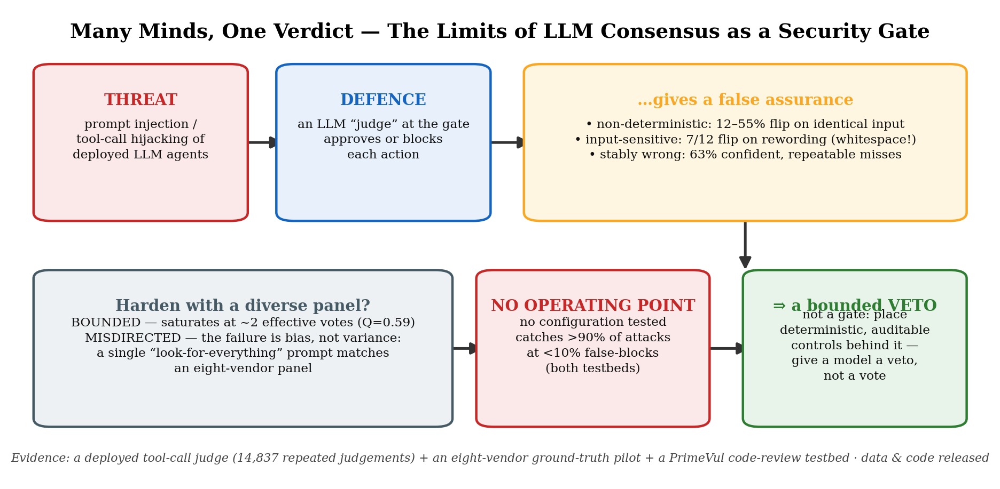

# P20 Artifact — Many Minds, One Verdict

Anonymised data and analysis code reproducing the core pilot, wave-2, and PrimeVul tables and the
census/temperature headline numbers of *"Many Minds, One Verdict: The Limits of LLM Consensus as a Security
Gate"* (Adrian Asher).



Everything here is **offline**: no model/API calls and no dependency on any
private corpus. The shipped CSVs are de-identified per-repetition vote matrices
(verdict per repetition, per case, per model); the scripts recompute all
statistics from them.

## Provenance (read this)

The RQ1/RQ2 **repeated-judgement census** (`data/votes_census_percase.csv`) is
derived from the author's own deployed LLM tool-call security judge, mined
read-only. This is one of *several* evidence sources in the paper and is used
only to motivate the phenomenon (it is conceded as non-novel; concurrent 2026
work documents LLM-judge instability generally). The load-bearing results —
the cross-vendor pilot, the bias-not-variance prompt study, the PrimeVul static
testbed, and the no-operating-point search — rest on the multi-vendor and public
data shipped here, not on the deployed judge. See the paper's Data Availability
and Threats-to-Validity sections for the full disclosure.

To protect proprietary content, the released CSVs contain **only** the fields
needed to reproduce the paper. Every free-text and identifying field from the
raw runs is dropped: the model's `reasoning` text, the judge system-prompt body,
build / invocation metadata, timestamps, token counts, inference region, and all
file paths. The benchmark scenario columns (`caseId`, `pretextType`,
`expectedVerdict`) are released because they *are* the test deck.

## Layout

```
artifact/
  data/        de-identified per-rep vote matrices (CSV) + derived stats
  scripts/     offline analysis + figure generation (Python 3, numpy/pandas/matplotlib/scipy)
  figures/     PDFs regenerated by the scripts
  README.md    this file
  LICENSE      MIT
```

### Data files

| File | Rows (incl. header) | What it is | Backs |
|---|---|---|---|
| `votes_census_percase.csv` | 1,438 | RQ1/RQ2 repeated-judgement census: per-(model, effort, deck, case) flip counts, confidences, catch-rate, over 3 Claude judges and repetition budgets 2/5/20/40 | Table 1, Figs. flip-by-model / temperature / reps / heatmap / adv12 / gallery |
| `votes_pilot.csv` | 2,881 | Cross-vendor pilot: 9 models / 8 vendors × 12 hijack cases × N=20, persona-neutral, per-rep verdicts + ground truth | Table 2, Fig. pilot |
| `votes_hard.csv` | 3,361 | 8-vendor persona-neutral on the hard deck (12 hijacks + 12 dual-use near-miss benigns) × N=20 | §5.6 hard-deck rows, Table 5 |
| `votes_wave2_persona.csv` | 5,761 | Wave-2 prompt study: 2 base models × {neutral, omni, 4 personas} on the hard deck × N=20 | Table 3, Fig. wave2 |
| `votes_primevul.csv` | 8,001 | Static code review: 4 vendors × 100 PrimeVul cases (50 vuln + 50 fixed) × N=20 | Table 4 (PrimeVul) |
| `votes_perturb.csv` | 1,201 | Meaning-preserving perturbation run (12 hijacks × 5 rewordings) — separates input-sensitivity from sampling non-determinism | §5.1 input-sensitivity |
| `votes_tempsweep.csv` | 721 | Controlled open-weight temperature sweep (T ∈ {0, 0.5, 1}), thinking off | §5.2 confirmatory T-sweep |
| `consensus_sim_results.csv` | 5 | Cached output of `consensus_sim.py` (self-ensemble vs diverse-panel stability) | Fig. consensus |
| `a0_statistics.md` | — | Generated stability report (cluster-bootstrap CIs, permutation tests) | §5.1/§5.2 CIs |

Per-rep CSV columns: `wave, deck, model, vendor, persona, caseId,
expectedVerdict, expectedCaught, rep, verdict, confidence, blocked, hijacked`.
`blocked = verdict ∈ {drifting, hijacked}` is the deployed fail-closed gate
decision; `hijacked` is the strict (confident auto-deny) decision.

## How to reproduce

Requirements: Python 3.9+, `numpy pandas matplotlib scipy`.

```bash
cd scripts

# 1. Headline numbers (Tables 2, 3, 4) — pure stdout, ~10 s
python reproduce.py

# 2. Per-figure regeneration (writes to ../figures/)
python make_figures.py        # RQ1/RQ2 census figures (flip-by-model, temperature, reps, heatmap, adv12, gallery)
python consensus_sim.py       # self-ensemble vs diverse-panel stability + reconstructed-temperature figure
python consensus_pilot.py     # cross-vendor pilot: panel rules, Yule's Q, conjunctive-vs-panel-size figure
python wave2_analysis.py      # bias-not-variance: omni vs persona ROC figure
python a0_stats.py            # cluster-bootstrap CIs / permutation tests -> ../data/a0_statistics.md, ../figures/a0_pareto.pdf
```

### Expected output of `reproduce.py` (matches the paper exactly)

- **Pilot (Table 2):** conjunctive 71.4%, majority 17.3%, unanimity ~6%, best
  single 60.8% (Opus 4.8); mean pairwise Yule's Q = 0.59; stably-wrong cells
  68/108 (≈63%).
- **Wave-2 (Table 3):** Opus 4.8 neutral 61.7% / omni 82.9% (F1 0.76 → 0.88);
  qwen3-235B neutral 46.7% / omni 80.0% (F1 0.63 → 0.89).
- **PrimeVul (Table 4):** Opus MCC 0.25 (best); Haiku 0.09, qwen 0.07,
  DeepSeek 0.01 (read MCC, not F1 — the deck is balanced).

## Re-deriving the CSVs from the raw corpus (authors only)

`scripts/extract_vote_matrices.py` is the provenance script that produced the
de-identified CSVs from the raw per-run JSONs. It is included for transparency;
**re-users do not need it** — the processed CSVs are already here. It requires
the authors' private results tree and is run as:

```bash
python extract_vote_matrices.py --raw-root /path/to/private/results -o ../data
```

## Licence

MIT --- see the `LICENSE` file. Released for reproduction and reuse.

## Citation

Archived release (v1): **DOI [10.5281/zenodo.21235385](https://doi.org/10.5281/zenodo.21235385)**

> Adrian Asher. *Many Minds, One Verdict: The Limits of LLM Consensus as a Security Gate —
> Reproducibility Artifact* (v1). Zenodo, 2026. https://doi.org/10.5281/zenodo.21235385

Please also cite the accompanying paper (submitted to ACM *Digital Threats: Research and Practice*).
